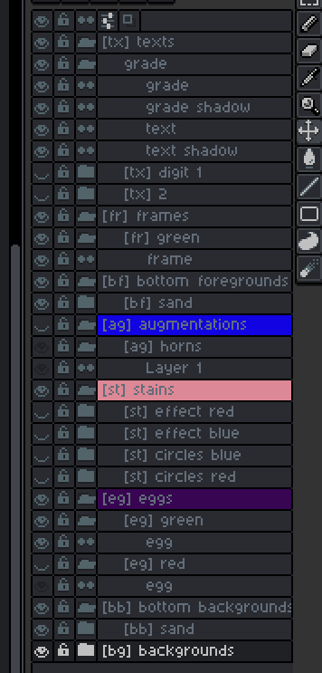

# aseprite scripts
This repo contains some usefule scripts for aseprite editor — https://www.aseprite.org/docs/scripting

Script execution can be attached to hotkeys
* decreasing/increasing brush
* generator script to generate a set of images based on random and metadata info from the layers

## Layers example

